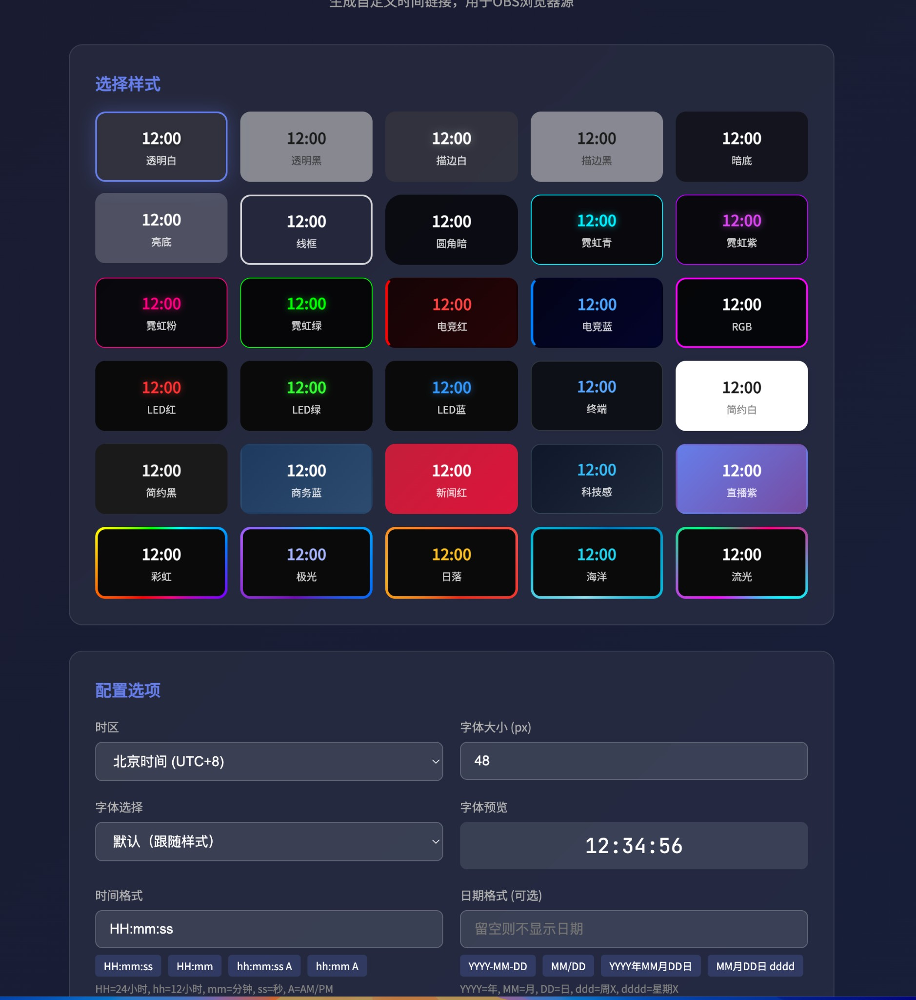

# OBS 时间显示器

一个简单的 OBS 时间显示网站，支持自定义时区、格式和样式。支持中文/English 切换。

## 在线预览

**[→ 打开配置页面](https://fxfyio.github.io/obstime/)**



## 使用方法

1. 打开 `config.html` 配置页面
2. 选择喜欢的样式和设置
3. 复制生成的链接
4. 在 OBS 中添加「浏览器」源，粘贴链接

## URL 参数

| 参数 | 说明 | 默认值 | 示例 |
|------|------|--------|------|
| `style` | 样式 | neon | neon/glass/minimal/dark/gradient/retro/text |
| `tz` | 时区 | Asia/Shanghai | America/New_York |
| `tf` | 时间格式 | HH:mm:ss | hh:mm A |
| `df` | 日期格式 | 无 | YYYY-MM-DD |
| `size` | 字体大小 | 48 | 60 |
| `color` | 文字颜色 | 无 | ff0000 |
| `bg` | 背景颜色 | 无 | 000000 |

## 样式列表

- `neon` - 霓虹风格
- `glass` - 玻璃拟态
- `minimal` - 简约白
- `dark` - 暗黑风格
- `gradient` - 渐变彩虹
- `retro` - 复古风格
- `text` - 纯文字（透明背景）

## 示例链接

```
index.html?style=neon&tz=Asia/Shanghai&tf=HH:mm:ss
index.html?style=gradient&df=YYYY年MM月DD日&size=60
index.html?style=text&tz=America/New_York&tf=hh:mm A
```

## 部署

直接将文件部署到任意静态网站托管服务即可。
